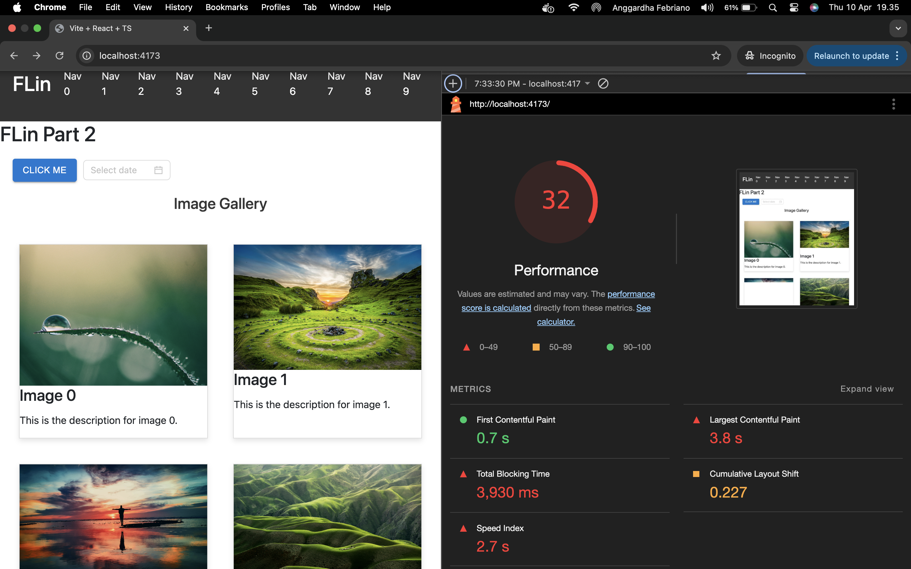
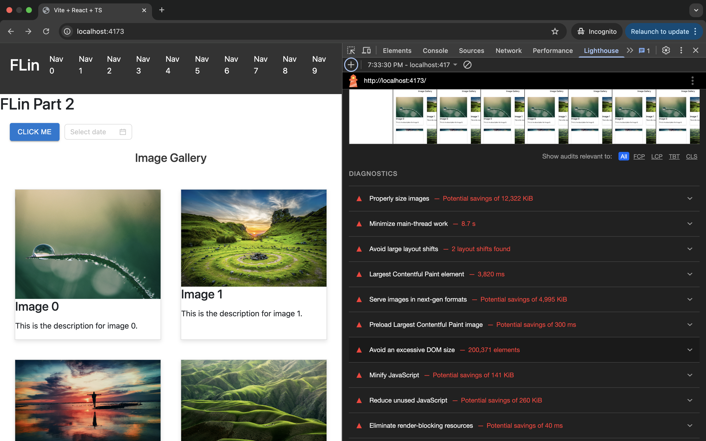
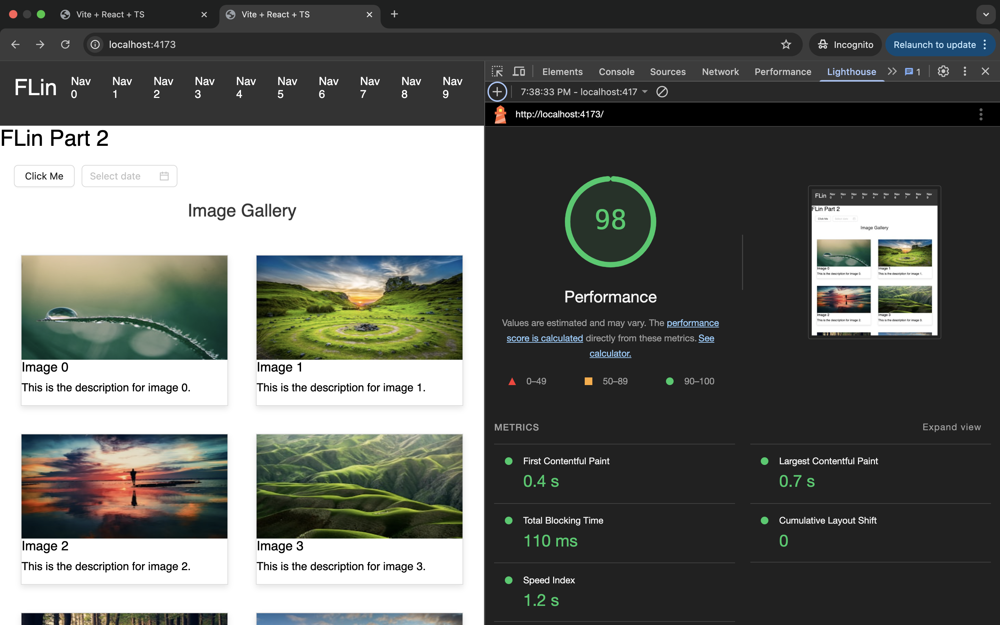
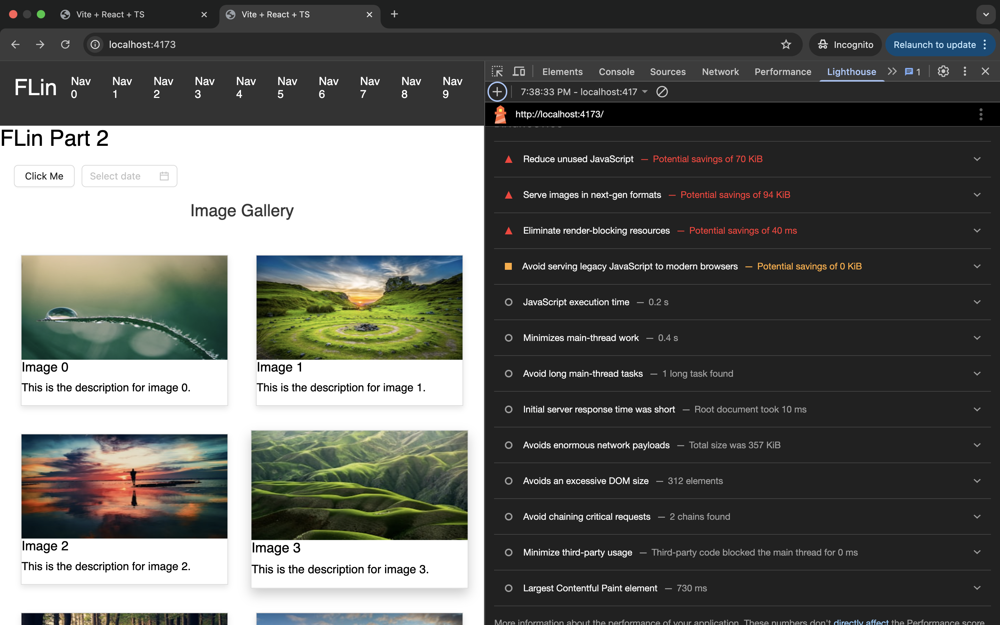

# PART 2

## Background

Since i need to try improving web performance, i started by create sample website which having bad performance, based on what actually could happen in real world [Bad Performance](./bad-performance), such as

- Lazy loading for images & assets.
- CSS & JavaScript minification.
- Reducing render-blocking resources.
- Using browser caching & CDN (if applicable).

### Bad Performance Website

1. I try to implement few use cases on each component
2. ImageGallery component to perform images/asset load with bad practice and performance
3. at main.tsx also exist section which rendering huge of elements which blocking other element to rendered properly
4. also when checking vite.config.ts, i try intentionally to not do any javascript minification and not try to chunking the javascript resource when building the project later on

### Testing Mechanism

1. For benchmarking, i use Google Lighthouse
2. To prevent any unwanted javascript/typescript resource when still on development mode, i will try to benchmark each website after i build the production build

### Optimisation (can be seen at /improve-performance)

#### Image Lazy and Eager Load based on LCP

##### Lazy Load

Since i'm performing loading bunch of images at once, it's already common knowledge for engineer to trying lazy load images which not yet shown in the viewport(screen). so i tried to do that at `components/ImageGallery.tsx`

##### Eager Load

Since on the first render of the website, few images are already shown without do any scrolling, the best practice for this are do eager load, also for addtion, i also do preload for LCP images (can be check at index.html)

#### List Virtualization

Since at main.tsx, i'm trying to rendering more than 100K elements at once, it's causing the website performance very slow because of huge tree of elements need to be rendered in the same page. common solution we can do are to do virtualization on this list of elements.

My solution are using react-window library to help me do the virtualization, and after that, huge improvement of performance happened.

#### Javascript Bundle Minification and Javascript Bundle Chunking

If we are using latest bundler like vite/webpack/rollup, usually those bundler already do minification and chunking for us, but since i did it on purpose to not do that, in my solution, i try to use default settings and successfully reducing javascript size bundler

## RESULT

#### BEFORE

#### AFTER

